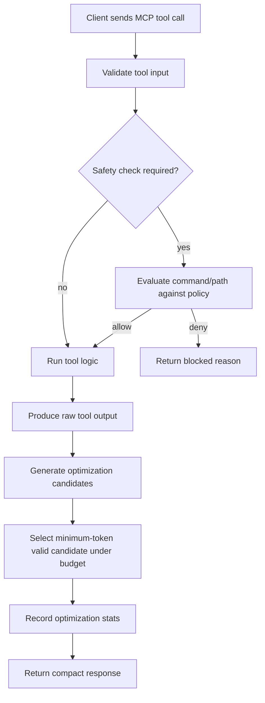
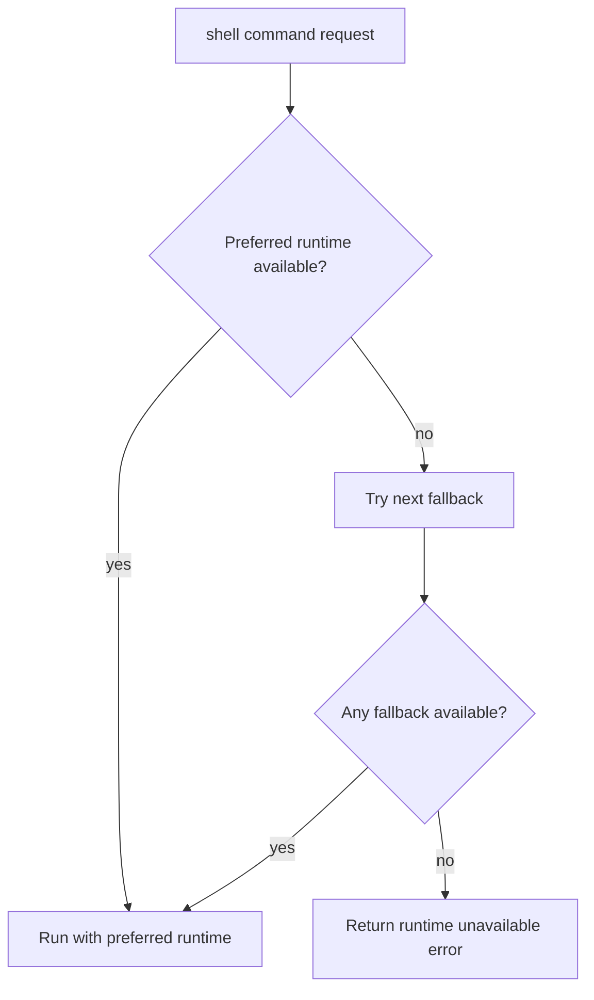

# WINDOWS CONTEXT MODE: HOW IT WORKS

## End-to-End Request Flow

## Shell Runtime Resolution (Windows-First)

`execute` resolves shell runtimes with Windows-first priority:

1. PowerShell (`pwsh`, then `powershell`)
2. `cmd.exe`
3. Git Bash (`bash.exe` from Git for Windows)

Language-specific requests (`powershell`, `cmd`, `bash`) force a matching preference before fallback.

## Safety and Policy Modes

Policy evaluation happens before execution:

- `strict` (default): blocks destructive commands and script-download-execute chains.
- `balanced`: blocks high-risk commands and flags some destructive commands for confirmation-style handling.
- `permissive`: allows commands broadly, but still protects sensitive file paths (for example `.env`, private keys).

## Compression and Stats

- Every response is optimization-scored using deterministic, content-aware strategies.
- The server returns the minimum-token valid candidate under the active budget.
- Stats track processed/changed responses, budget-forced responses, and bytes/tokens saved.
- `stats_get` returns in-memory totals and per-tool breakdown.
- `stats_export` writes a JSON report (default location under `%TEMP%`).

## Measured Improvement

Measured on March 5, 2026 against the previous response path on a deterministic sample set:

- Legacy output tokens: `3110`
- Current output tokens: `2977`
- Net reduction: `133 tokens` (`4.3%`)

Breakdown highlights:

- `git log` sample: `647 -> 619` tokens (`4.3%`)
- `application logs` sample: `296 -> 267` tokens (`9.8%`)
- `markdown docs` sample: `2077 -> 2048` tokens (`1.4%`)
- `proxy guidance text`: `56 -> 9` tokens (`83.9%`)

## Knowledge Base Path

`index` and `fetch_and_index` store chunked content in SQLite (FTS5 + BM25).  
`search` returns ranked passages for query-driven recall.

## Diagnostics

`doctor` reports:

- active platform/runtime details
- resolved default shell
- policy mode
- compression and timeout config
- safety self-check sample results
