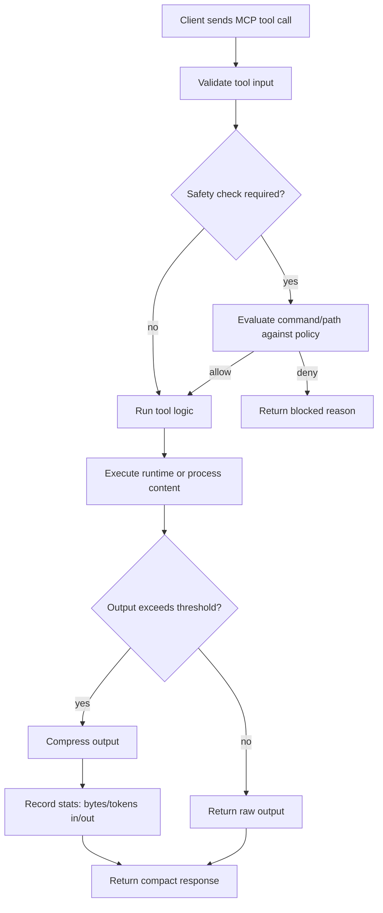
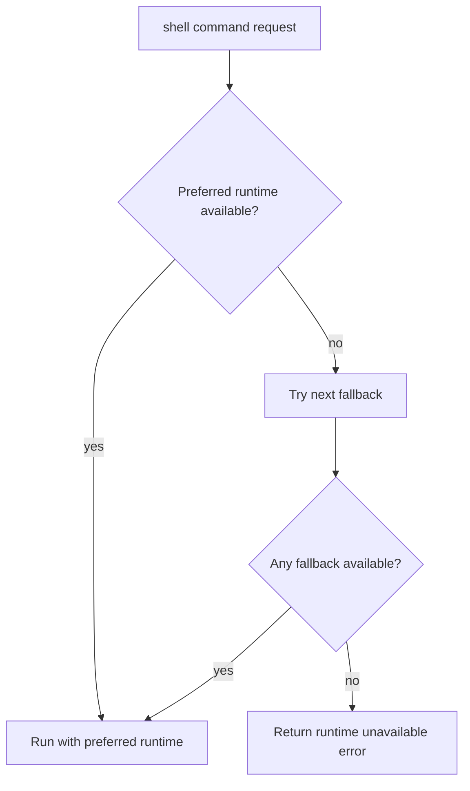

# Windows Context Mode: How It Works

## End-to-End Request Flow

## Shell Runtime Resolution (Windows-First)

`execute` resolves shell runtimes with Windows-first priority:

1. PowerShell (`pwsh`, then `powershell`)
2. `cmd.exe`
3. Git Bash (`bash.exe` from Git for Windows)

Language-specific requests (`powershell`, `cmd`, `bash`) force a matching preference before fallback.

## Safety and Policy Modes

Policy evaluation happens before execution:

- `strict` (default): blocks destructive commands and script-download-execute chains.
- `balanced`: blocks high-risk commands and flags some destructive commands for confirmation-style handling.
- `permissive`: allows commands broadly, but still protects sensitive file paths (for example `.env`, private keys).

## Compression and Stats

- Large outputs are compressed using deterministic, content-aware strategies.
- Compression tracks session-level bytes/tokens saved.
- `stats_get` returns in-memory totals and per-tool breakdown.
- `stats_export` writes a JSON report (default location under `%TEMP%`).

## Knowledge Base Path

`index` and `fetch_and_index` store chunked content in SQLite (FTS5 + BM25).  
`search` returns ranked passages for query-driven recall.

## Diagnostics

`doctor` reports:

- active platform/runtime details
- resolved default shell
- policy mode
- compression and timeout config
- safety self-check sample results
