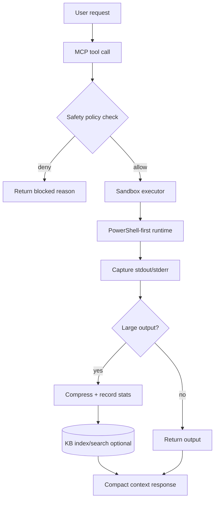
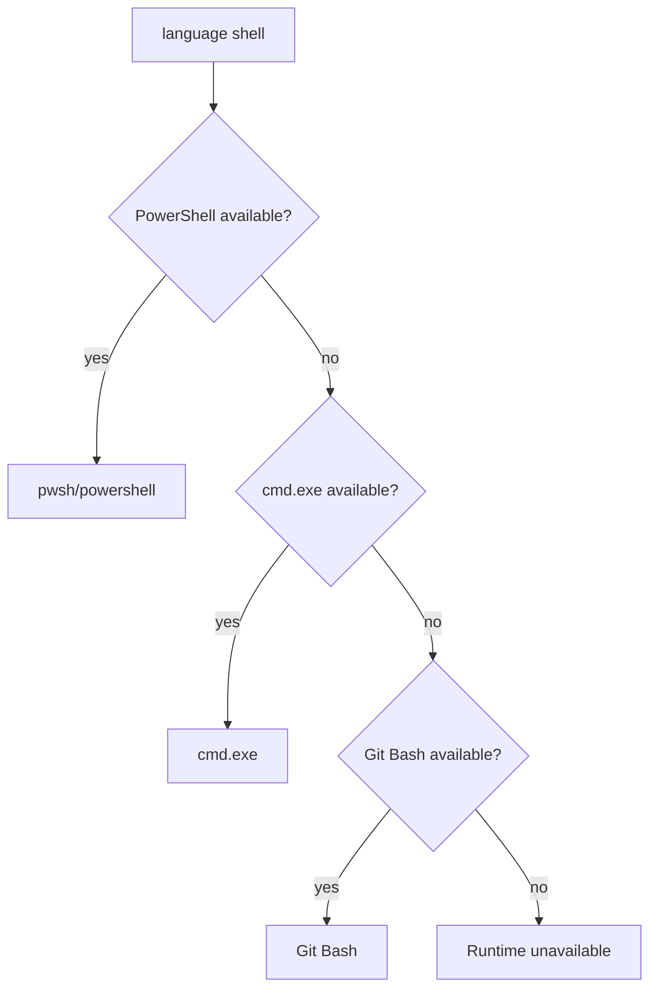

# Windows Context Mode: How it Works

## End-to-end flow

## Windows shell strategy

## Telemetry

- Every compressed event records bytes/tokens in/out.
- `stats_get` shows session totals and per-tool savings.
- `stats_export` writes JSON report (default `%TEMP%`).

